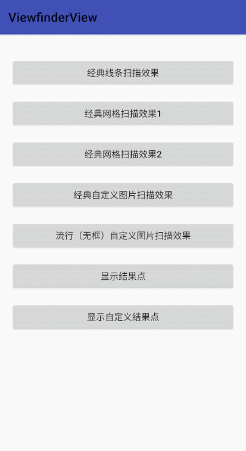

# ViewfinderView

[](https://raw.githubusercontent.com/jenly1314/ViewfinderView/master/app/release/app-release.apk)
[](https://repo1.maven.org/maven2/com/github/jenly1314/viewfinderview)
[](https://jitpack.io/#jenly1314/ViewfinderView)
[](https://travis-ci.org/jenly1314/ViewfinderView)
[](https://circleci.com/gh/jenly1314/ViewfinderView)
[](https://android-arsenal.com/api?level=21)
[](http://www.apache.org/licenses/LICENSE-2.0)
[](https://jenly1314.github.io/)
[](http://shang.qq.com/wpa/qunwpa?idkey=8fcc6a2f88552ea44b1.1.982c94fd124f7bb3ec227e2a400dbbfaad3dc2f5ad)

ViewfinderView 是一个取景视图：主要用于渲染扫描相关的动画效果。其样式主要分为两大类：classic：经典样式（带扫描框）、popular：流行样式（不带扫描框）；可任意定制。

> 如果你之前有使用过 [ZXingLite](https://github.com/jenly1314/ZXingLite) 或 [MLKit](https://github.com/jenly1314/MLKit)，可能会用到其内部的 **ViewfinderView**。现已将 **ViewfinderView** 独立出来，便于后续统一维护。

> 以后[ZXingLite](https://github.com/jenly1314/ZXingLite)、[MLKit](https://github.com/jenly1314/MLKit)、[WeChatQRCode](https://github.com/jenly1314/WeChatQRCode) 都将直接使用此 **ViewfinderView** 作为通用的扫描渲染视图。

## Gif 展示


> 你也可以直接下载 [演示App](https://raw.githubusercontent.com/jenly1314/ViewfinderView/master/app/release/app-release.apk) 体验效果

## ViewfinderView属性说明

| 属性                        | 属性类型   | 默认值                                | 属性说明                                            |
|:---------------------------|:----------|:-------------------------------------|:------------------------------------------------|
| vvViewfinderStyle          | enum      | classic                              | 取景框样式；支持：classic：经典样式（带扫描框）、popular：流行样式（不带扫描框） |
| vvMaskColor                | color     | <font color=#000000>#60000000</font> | 扫描区外遮罩的颜色                                       |
| vvFrameColor               | color     | <font color=#1FB3E2>#7F1FB3E2</font> | 扫描区边框的颜色                                        |
| vvFrameWidth               | dimension |                                      | 扫描框宽度                                           |
| vvFrameHeight              | dimension |                                      | 扫描框高度                                           |
| vvFrameRatio               | float     | 0.625f                               | 扫描框与屏幕占比,当未设置扫描框的宽高时，使用占比来计算宽高                  |
| vvFrameLineStrokeWidth     | dimension | 1dp                                  | 边框线宽度                                           |
| vvFramePaddingLeft         | dimension | 0                                    | 扫描框左边的内间距                                       |
| vvFramePaddingTop          | dimension | 0                                    | 扫描框上边的内间距                                       |
| vvFramePaddingRight        | dimension | 0                                    | 扫描框右边的内间距                                       |
| vvFramePaddingBottom       | dimension | 0                                    | 扫描框下边的内间距                                       |
| vvFrameGravity             | enum      | center                               | 扫描框对齐方式                                         |
| vvFrameCornerColor         | color     | <font color=#1FB3E2>#FF1FB3E2</font> | 扫描区边角的颜色                                        |
| vvFrameCornerSize          | dimension | 16dp                                 | 扫描区边角的大小                                        |
| vvFrameCornerStrokeWidth   | dimension | 4dp                                  | 扫描区边角的描边宽度                                      |
| vvFrameDrawable            | reference |                                      | 扫描框自定义图片                                        |
| vvLaserLineHeight          | dimension | 5dp                                  | 激光扫描线高度                                         |
| vvLaserMovementSpeed       | dimension | 2dp                                  | 激光扫描线的移动速度                                      |
| vvLaserAnimationInterval   | integer   | 20                                   | 扫描动画延迟间隔时间，单位：毫秒                                |
| vvLaserGridColumn          | integer   | 20                                   | 网格激光扫描列数                                        |
| vvLaserGridHeight          | integer   | 40dp                                 | 网格激光扫描高度，为0dp时，表示动态铺满                           |
| vvLaserColor               | color     | <font color=#1FB3E2>#FF1FB3E2</font> | 扫描区激光线的颜色                                       |
| vvLaserStyle               | enum      | line                                 | 激光扫描的样式                                         |
| vvLaserDrawable            | reference |                                      | 激光扫描线自定义图片                                      |
| vvLaserDrawableRatio       | float     | 0.625f                               | 激光扫描图片与屏幕占比                                     |
| vvLabelText                | string    |                                      | 扫描提示文本信息                                        |
| vvLabelTextColor           | color     | <font color=#C0C0C0>#FFC0C0C0</font> | 提示文本字体颜色                                        |
| vvLabelTextSize            | dimension | 14sp                                 | 提示文本字体大小                                        |
| vvLabelTextPadding         | dimension | 24dp                                 | 提示文本距离扫描区的间距                                    |
| vvLabelTextWidth           | dimension |                                      | 提示文本的宽度，默认为View的宽度                              |
| vvLabelTextLocation        | enum      | bottom                               | 提示文本显示位置                                        |
| vvPointColor               | color     | <font color=#1FB3E2>#FF1FB3E2</font> | 结果点的颜色                                          |
| vvPointStrokeColor         | color     | <font color=#FFFFFF>#FFFFFFFF</font> | 结果点描边的颜色                                        |
| vvPointRadius              | dimension | 15dp                                 | 结果点的半径                                          |
| vvPointStrokeRatio         | float     | 1.2                                  | 结果点描边半径与结果点半径的比例                                |
| vvPointDrawable            | reference |                                      | 结果点自定义图片                                        |
| vvPointAnimation           | boolean   | true                                 | 是否显示结果点的动画                                      |
| vvPointAnimationInterval   | integer   | 3000                                 | 结果点动画间隔时长；单位：毫秒                                 |

> ViewfinderView相关的自定义属性统一使用 **vv** 开头。

## 引入

### Gradle:

1. 在Project的 **build.gradle** 里面添加远程仓库

```gradle
allprojects {
    repositories {
        //...
        mavenCentral()
    }
}
```

2. 在Module的 **build.gradle** 里面添加引入依赖项

```gradle
// AndroidX 版本
implementation 'com.github.jenly1314:viewfinderview:1.0.0'

```

## 示例

### 布局示例

ViewfinderView 相关的自定义属性可参见上面的 **ViewfinderView属性说明**

```xml
    <com.king.view.viewfinderview.ViewfinderView
        android:id="@+id/viewfinderView"
        android:layout_width="match_parent"
        android:layout_height="match_parent"
        app:vvLaserStyle="line" />
```

更多使用详情，请查看[app](app)中的源码使用示例或直接查看 [API帮助文档](https://jitpack.io/com/github/jenly1314/ViewfinderView/latest/javadoc/)

### 相关推荐

#### [ZXingLite](https://github.com/jenly1314/ZXingLite) 基于ZXing库优化扫码和生成二维码/条形码功能，扫码界面完全支持自定义。
#### [MLKit](https://github.com/jenly1314/MLKit) 一个强大易用的工具包。通过ML Kit您可以很轻松的实现文字识别、条码识别、图像标记、人脸检测、对象检测等功能。
#### [WeChatQRCode](https://github.com/jenly1314/WeChatQRCode) 基于OpenCV开源的微信二维码引擎移植的扫码识别库。

## 版本记录

#### v1.0.0：2023-3-19
* ViewfinderView初始版本

## 赞赏
如果您喜欢ZXingLite，或感觉ZXingLite帮助到了您，可以点右上角“Star”支持一下，您的支持就是我的动力，谢谢 :smiley:<p>
您也可以扫描下面的二维码，请作者喝杯咖啡 :coffee:
<div>

</div>

## 关于我
Name: <a title="关于作者" href="https://jenly1314.github.io" target="_blank">Jenly</a>

Email: <a title="欢迎邮件与我交流" href="mailto:jenly1314@gmail.com" target="_blank">jenly1314#gmail.com</a> / <a title="给我发邮件" href="mailto:jenly1314@vip.qq.com" target="_blank">jenly1314#vip.qq.com</a>

CSDN: <a title="CSDN博客" href="http://blog.csdn.net/jenly121" target="_blank">jenly121</a>

CNBlogs: <a title="博客园" href="https://www.cnblogs.com/jenly" target="_blank">jenly</a>

GitHub: <a title="GitHub开源项目" href="https://github.com/jenly1314" target="_blank">jenly1314</a>

Gitee: <a title="Gitee开源项目" href="https://gitee.com/jenly1314" target="_blank">jenly1314</a>

加入QQ群: <a title="点击加入QQ群" href="http://shang.qq.com/wpa/qunwpa?idkey=8fcc6a2f88552ea44b1411582c94fd124f7bb3ec227e2a400dbbfaad3dc2f5ad" target="_blank">20867961</a>
   <div>
       
       
   </div>